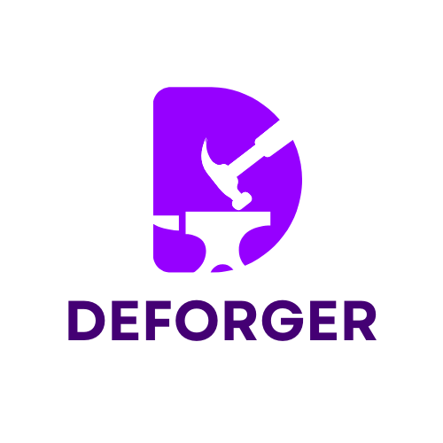
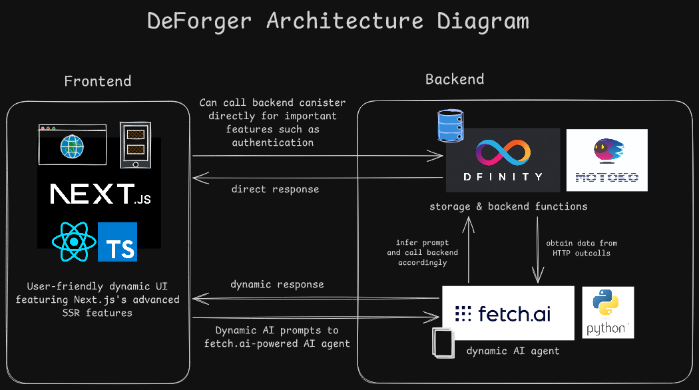
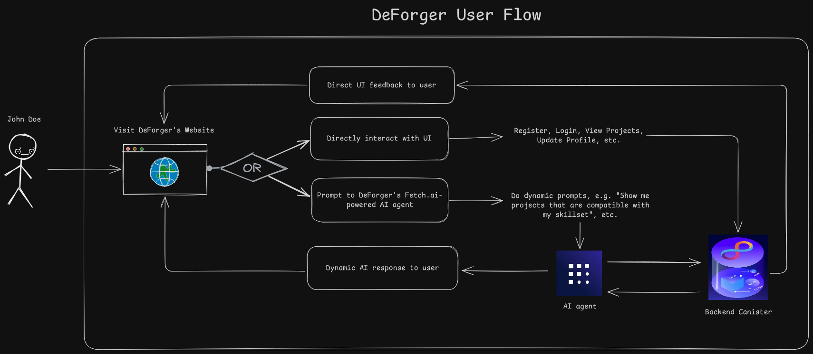
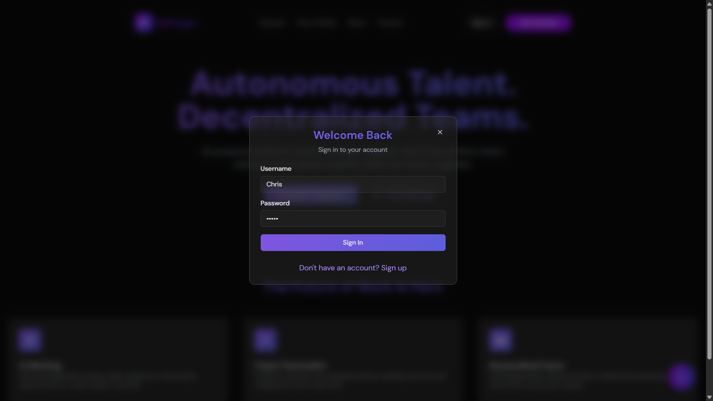
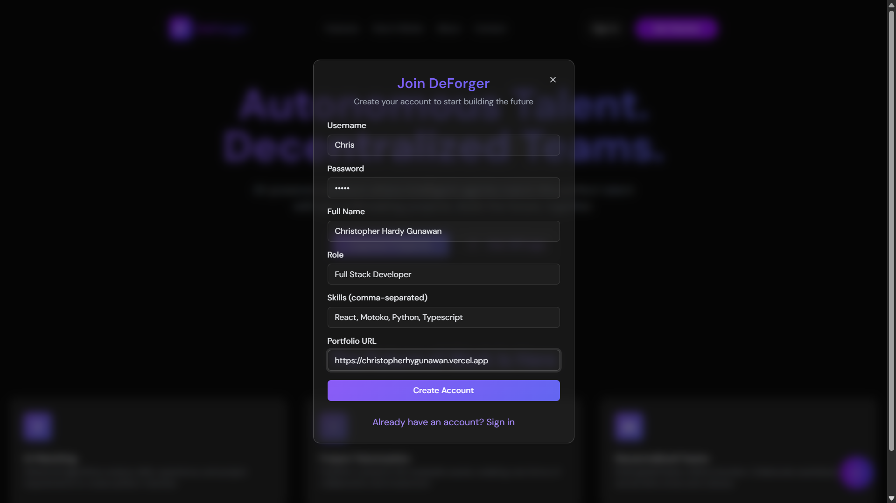

  

# DeForger

<p align="center">

</p>

DeForger is a decentralized platform leveraging Fetch.ai autonomous agents and the Internet Computer (ICP) for seamless talent discovery, team collaboration, and project investment through tokenized Real World Assets (RWAs).

-----

## 🚀 Introduction

Our vision is to create a trustless, autonomous platform where entrepreneurs and skilled professionals can form teams, collaborate on innovative projects, and invest in opportunities seamlessly.

DeForger integrates **Fetch.ai's AI agents** for proactive, 24/7 talent matchmaking with **ICP's decentralized backend** for transparent, secure, and immutable records of profiles, agreements, communications, tokenized shares, and user accounts.

-----

## 🎯 The Problem: The Innovation Bottleneck

Today's innovation landscape is hindered by significant inefficiencies that prevent great ideas from becoming reality. These bottlenecks lead to negative outcomes for the entire ecosystem.

### Key Challenges:

  - **Inefficient & Centralized Talent Discovery**: Finding collaborators is slow and relies on centralized platforms that charge high fees, control user data, and lack transparency.
  - **Lack of Trust in Collaboration**: Early-stage projects are plagued by uncertainty. Without clear, enforceable agreements, disputes over ownership and contributions often lead to project failure.
  - **Inaccessible Early-Stage Funding**: Founders struggle to secure pre-seed funding, while everyday investors are locked out of high-potential, early-stage investment opportunities.

### The Result:

  - Stifled Economic Growth
  - Slowed Societal Progress
  - Wasted Human Potential
  - Reinforced Inequality

-----

## 💡 Our Solution

DeForger is a trustless platform that **automates** talent matchmaking, **secures** collaboration, and **democratizes** project funding using the combined power of AI and blockchain.

### What We Offer:

  - **🤖 AI-Powered Matchmaking**: Our Fetch.ai agent works 24/7, intelligently connecting skilled professionals with projects based on on-chain data, eliminating the need for manual searching.
  - **🔗 On-Chain Collaboration & Trust**: All agreements, roles, and communications are immutably recorded on the Internet Computer (ICP), creating a single source of truth and ensuring complete transparency from day one.
  - **💸 Democratized Funding via RWAs**: Projects can tokenize their equity as Real World Assets (RWAs), allowing team members, supporters, and investors to buy shares and own a piece of the future, seamlessly.

-----

## 🏛️ Architecture

The project is built with a modern, decentralized tech stack. Below is the high-level architecture diagram illustrating how the components interact.

<p align="center">

</p>

  - **Frontend**: A responsive and interactive user interface built with **Next.js**, **TypeScript**, and styled with **TailwindCSS**.
  - **Backend**: A secure and robust canister running on the **Internet Computer (ICP)**, written in **Motoko**.
  - **AI Agent**: An autonomous agent powered by **Fetch.ai's uAgents framework** and **Python**, integrated with the **ASI:ONE** language model for natural language understanding and function calling.

-----

## 🌊 User Flow

This diagram outlines the typical journey of a user on the DeForger platform, from registration to project collaboration and investment.

<p align="center">

</p>

-----

## 🎨 Mockups

Here's a sneak peek at the DeForger user interface.

<details open>
<summary><strong>Click to expand and view all mockups</strong></summary>
<br>
<table>
<tr>
<td></td>
<td></td>
</tr>
<tr>
<td align="center"><em>Home Page</em></td>
<td align="center"><em>Dashboard Page</em></td>
</tr>
<tr>
<td></td>
<td></td>
</tr>
<tr>
<td align="center"><em>Browse Projects</em></td>
<td align="center"><em>Project Detail</em></td>
</tr>
<tr>
<td></td>
<td></td>
</tr>
<tr>
<td align="center"><em>Create Project</em></td>
<td align="center"><em>Tokenize Project</em></td>
</tr>
<tr>
<td></td>
<td></td>
</tr>
<tr>
<td align="center"><em>AI Copilot Interaction</em></td>
<td align="center"><em>Team Chat</em></td>
</tr>
<tr>
<td></td>
<td></td>
</tr>
<tr>
<td align="center"><em>Login Page</em></td>
<td align="center"><em>Register Page</em></td>
</tr>
</table>
</details>

-----

## Project Structure

Here is an overview of the project's monorepo structure:

```
DeForger/
├── deforger-backend/
│   ├── fetch/                  # Fetch.ai Agent implementation
│   │   └── agent.py            # Main agent logic for interacting with ICP
│   └── ic/                     # Internet Computer (ICP) Canister
│       └── src/
│           └── backend/
│               ├── main.mo   # Core canister logic and public methods
│               └── Types.mo  # Data models and type definitions
│
├── defforger-frontend/
│   ├── app/                    # Next.js 15+ App Router pages
│   ├── public/                 # Static assets (diagrams, mockups, logo)
│   └── ...
│
└── README.md                   # This file
```

-----

## 🔧 Local Development Setup

To get DeForger running on your local machine, follow these steps:

1.  **Deploy the Backend Canister (ICP):**

      - Navigate to the frontend directory:

        ```bash
        cd deforger-frontend
        ```

      - Start a local ICP network:

        ```bash
        dfx start --clean --background
        ```

      - Generate canister declarations:

        ```bash
        dfx generate backend
        ```

      - Add your ASI:ONE API Key to a `.env` file in the `deforger-frontend` directory:

        ```
        NEXT_PUBLIC_ASI_ONE_API_KEY=your_key_here
        ```

      - **Modify `index.js` files**: Update the following two files to ensure the frontend uses the correct canister ID from environment variables.

          - `deforger-frontend/.dfx/local/canisters/backend/index.js`
          - `deforger-frontend/declarations/backend/index.js`

        Replace the existing `canisterId` export with this code:

        ```javascript
        export const canisterId =
          process.env.CANISTER_ID_BACKEND ||
          process.env.NEXT_PUBLIC_BACKEND_CANISTER_ID;
        ```

        <details open>
        <summary>Click to see screenshots of the file modifications</summary>
        <br>
        <b>.dfx/local/canisters/backend/index.js</b>
        <br>
        
        <br><br>
        <b>declarations/backend/index.js</b>
        <br>
        
        </details>
        <br>

      - Build and deploy the Motoko canister locally:

        ```bash
        dfx deploy
        ```

2.  **Run the AI Agent (Fetch.ai):**

      - Navigate to the agent directory:
        ```bash
        cd deforger-backend/fetch
        ```
      - Activate your Python virtual environment:
        ```bash
        # Linux or macOS
        source venv/bin/activate
        # Windows
        venvScriptsactivate
        ```
      - Run the agent script:
        ```bash
        # Linux or macOS
        python3 agent.py
        # Windows
        python agent.py
        ```
      - Open the agent's inspection page in your browser and connect to the mailbox.

3.  **Launch the Frontend Application:**

      - Navigate to the frontend directory:
        ```bash
        cd deforger-frontend
        ```
      - Install dependencies:
        ```bash
        npm install
        ```
      - Start the development server:
        ```bash
        npm run dev
        ```

-----

## 🤖 DeForger AI Agent

The core of our intelligent automation is the DeForger AI Agent. You can interact with it to perform actions on the platform using natural language.

  - **Agent Name:** `DeForger AI Agent`
  - **Agent Address:** `test-agent://agent1q2fz6srx3z6crus7a8tymcp40jph0237xv8m45f7wqt8tksfkte85m86dm2`

### 🛠️ Agent Capabilities & Example Queries

<details open>
<summary><strong>Click to see example user queries for the agent</strong></summary>

```
# User Registration
Register me with username alice, password secret, name Alice Smith, role Developer, skills python rust, portfolio https://alice.com.

# User Login
Log me in with username alice and password secret.

# Project Creation
Create a project named Awesome App, vision Build a revolutionary app, open roles developer "python rust", designer "ui ux", with token [your_session_token].

# Apply to a Project
Apply to project 1 with message I have the skills, token [your_session_token].

# Buy Project Shares
Buy 10 shares in project 1, token [your_session_token].
```

</details>

-----

## ✨ Features

### 🌐 Internet Computer (ICP) Features Used

  - **Canister Development in Motoko**: The backend is implemented as an ICP canister, providing a decentralized and immutable data layer.
  - **Persistent Storage with HashMaps**: Utilizes `HashMap` from `mo:base` to store all user, project, and application data on-chain.
  - **Custom Account System**: Implements user authentication with username/password hashing (`SHA-256`) and session token management.
  - **HTTP Interface**: Supports `http_request` and `http_request_update` for secure frontend interaction with JSON responses.
  - **Type Definitions**: Defines structured data types (`UserProfile`, `Project`, etc.) in `Types.mo` for robust on-chain data management.
  - **Share Balance Management**: Manages tokenized project shares using `HashMap` to simulate RWA tokenization.

### 🤖 Fetch.ai Features Used

  - **uAgents Framework**: Utilizes Fetch.ai's `uagents` library to implement the autonomous agent for handling interactions and function calls.
  - **Chat Protocol**: Leverages the `chat_protocol_spec` for robust, reliable, and stateful agent communication.
  - **Asynchronous Message Handling**: Uses async handlers (`@chat_proto.on_message`) for non-blocking processing of user queries.
  - **Tool Integration**: Defines a comprehensive set of function-calling tools structured as JSON schemas for the ASI:ONE API.
  - **ASI:ONE API Integration**: Interfaces with the ASI:ONE AI service for processing natural language, parsing tool calls, and generating responses.

-----

## 🧗 Challenges Faced

The primary challenge was integrating the niche and emerging technologies of **Motoko (ICP) and the Fetch.ai uAgents framework**. The lack of comprehensive examples and documentation for connecting these two specific ecosystems required significant experimentation and problem-solving.

-----

## 🔮 Future Plans

  - **UI/UX Refinement**: Enhance the user interface based on community feedback.
  - **Mainnet Launch**: Deploy DeForger on the ICP mainnet.
  - **ICRC-1 Integration**: Implement the full token standard for project RWAs to enhance interoperability.
  - **DeForger DAO**: Transition platform governance to a DAO, giving control to the community.
  - **DeFi Integration**: Integrate decentralized finance protocols for project treasury management.

-----

## 📈 Technical Difficulty

This project was **quite challenging** due to the direct integration of multiple new and specialized technologies. A particularly advanced feature we successfully implemented was the **uAgents Chat Protocol**, which allows for more complex and stateful conversations with the AI agent, ensuring reliable message delivery and handling.
